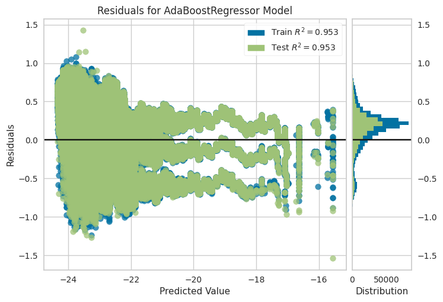
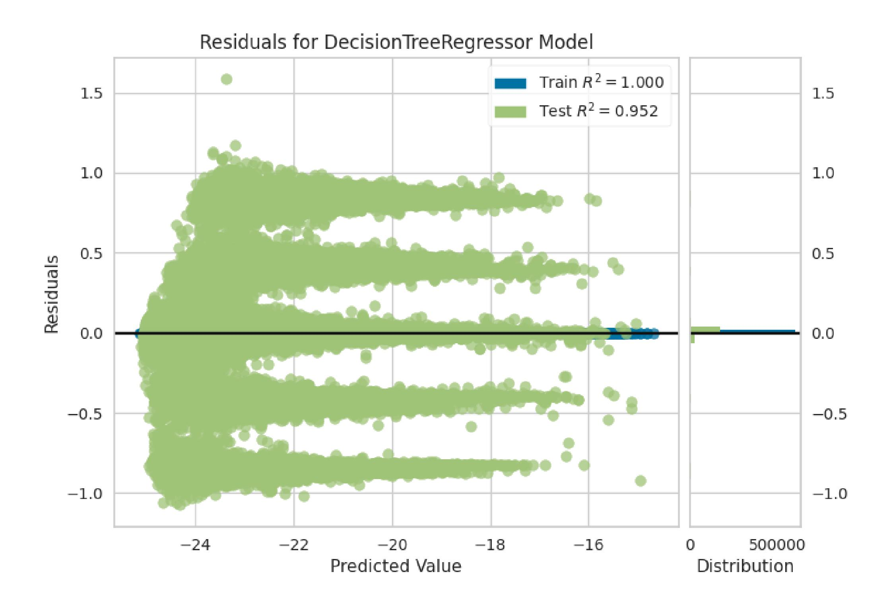
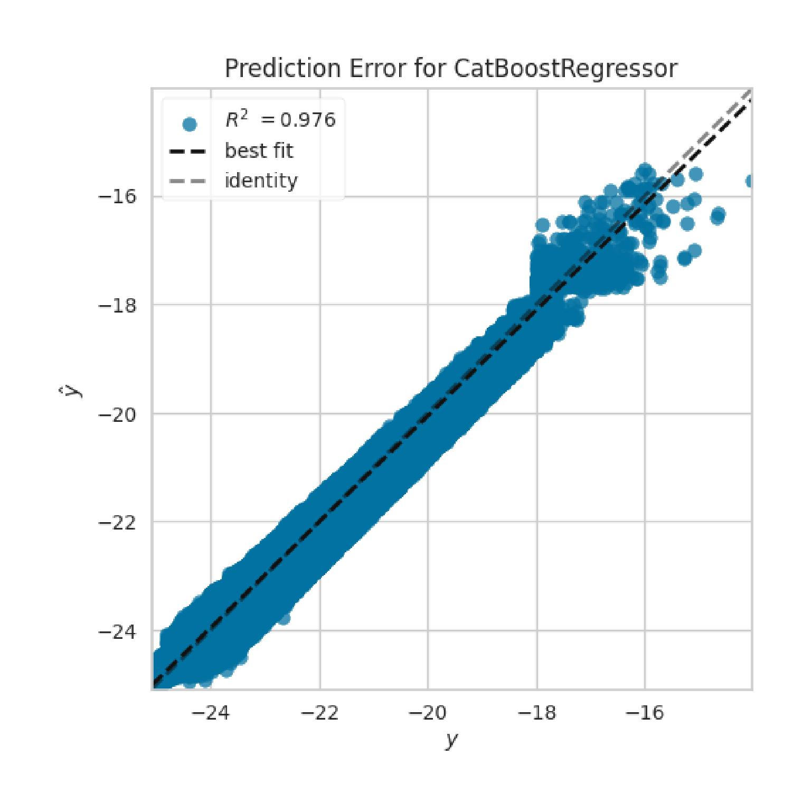
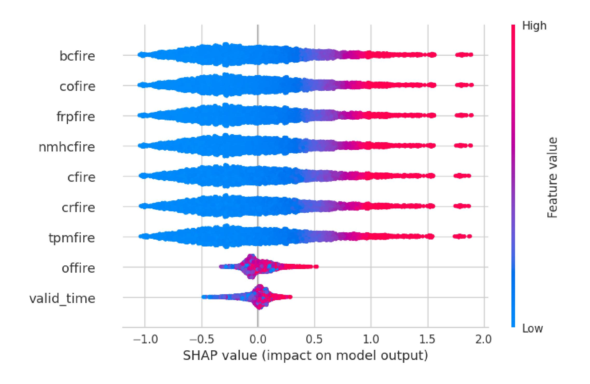
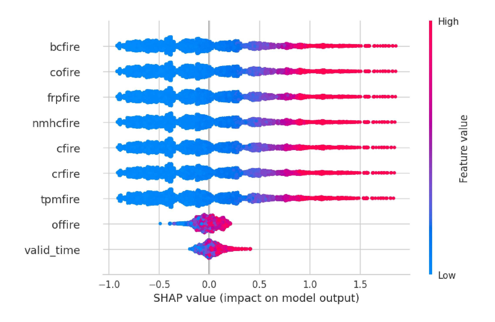
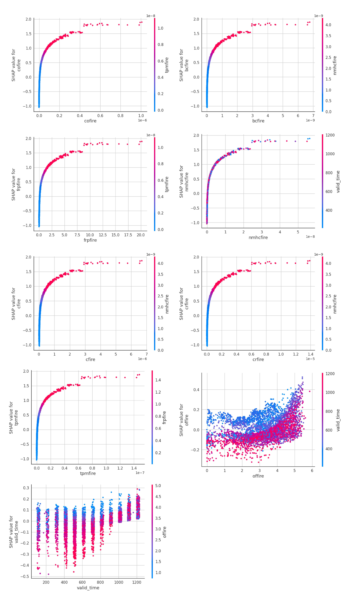
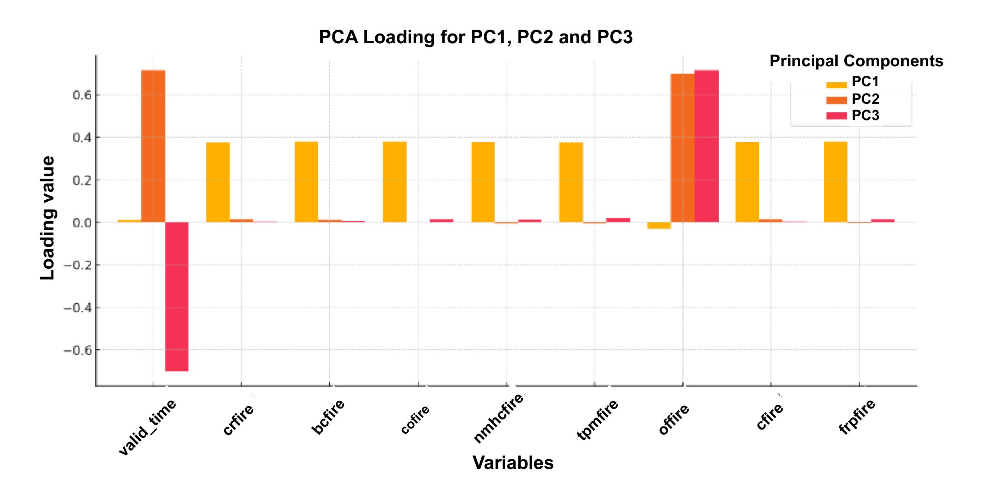

# Residual plot - AdaBoost

.

# Residual plot - Decision Tree

.

# Prediction Error - CatBoost

.

# SHAP - CataBoost

.

# SHAP - AdaBoost

.

# SHAP - Dependency plot
.

# PCA plot
.

# Table 1: An overview of the preprocessing information and PyCaret setup configuration for the regression experiment.

| Description                                   | Feature | Metric     |
|-----------------------------------------------|---------|------------|
| Wildfire combustion rate                      | crfire  | kg m⁻² s⁻¹ |
| Wildfire flux of black carbon                 | bcfire  | kg m⁻² s⁻¹ |
| Wildfire flux of carbon monoxide              | cofire  | kg m⁻² s⁻¹ |
| Wildfire flux of methane                      | CH4     | kg m⁻² s⁻¹ |
| Wildfire flux of non-methane hydrocarbons     | nmhcfire| kg m⁻² s⁻¹ |
| Wildfire flux of total particulate matter d < 2.5 µm (PM2.5) | tpmfire | kg m⁻² s⁻¹ |
| Wildfire fraction of area observed            | offire  | dimensionless |
| Wildfire fraction of area observed            | cffire  | kg m⁻² s⁻¹ |
| Wildfire radiative power                      | frpfire | W m⁻²      |
| Altitude of plume top                         | apt     | m          |

# Table 2: An overview of the preprocessing information and PyCaret setup configuration for the regression experiment

| Description                 | Value        |
|-----------------------------|--------------|
| Session id                  | 1234         |
| Target                      | ch4fire      |
| Target type                 | Regression   |
| Original data shape         | (862136, 4)  |
| Transformed data shape      | (862136, 4)  |
| Transformed train set shape | (603495, 4)  |
| Transformed test set shape  | (258641, 4)  |
| Numeric features            | 3            |
| Preprocess                  | True         |
| Imputation type             | simple       |
| Numeric imputation          | mean         |
| Fold Generator              | KFold        |
| Fold Number                 | 10           |
| CPU Jobs                    | -1           |

# SHAPLEY ADDITIVE EXPLANATION (SHAP)
In this work, we use SHAP (SHapley Additive exPlanations) plots to analyse the outputs of various machine learning algorithms. SHAP is based on game theory, 
where a scenario is modelled with $M$ players and a contribution function $v(S)$ represents the total expected payoff obtained by a subset of players $S$.

The Shapley value ensures a fair distribution of total gains among players. For a given player $j$, the Shapley value is defined as:

ϕ(v)j​=ϕj​=S⊆M∖{j}∑​∣M∣!∣S∣!(∣M∣−∣S∣−1)!​(v(S∪{j})−v(S))    (1)

