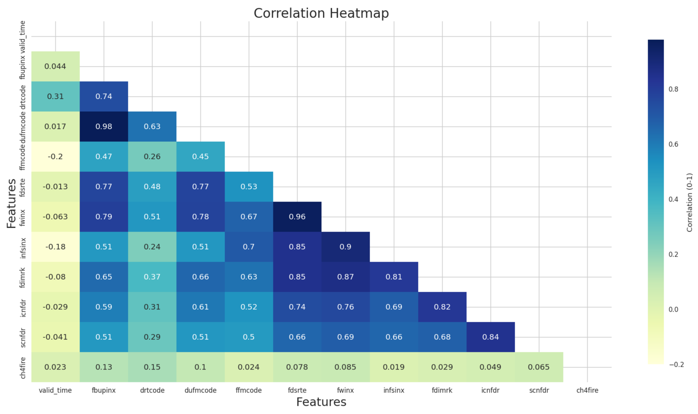

# Residual plot - AdaBoost

.

# Residual plot - Decision Tree

.

# Prediction Error - CatBoost

.

# SHAP - CataBoost

.

# SHAP - AdaBoost

.

# SHAP - Dependency plot
.

# PCA plot
.

# Table 1: An overview of the preprocessing information and PyCaret setup configuration for the regression experiment.

| Description                                   | Feature | Metric     |
|-----------------------------------------------|---------|------------|
| Wildfire combustion rate                      | crfire  | kg m⁻² s⁻¹ |
| Wildfire flux of black carbon                 | bcfire  | kg m⁻² s⁻¹ |
| Wildfire flux of carbon monoxide              | cofire  | kg m⁻² s⁻¹ |
| Wildfire flux of methane                      | CH4     | kg m⁻² s⁻¹ |
| Wildfire flux of non-methane hydrocarbons     | nmhcfire| kg m⁻² s⁻¹ |
| Wildfire flux of total particulate matter d < 2.5 µm (PM2.5) | tpmfire | kg m⁻² s⁻¹ |
| Wildfire fraction of area observed            | offire  | dimensionless |
| Wildfire fraction of area observed            | cffire  | kg m⁻² s⁻¹ |
| Wildfire radiative power                      | frpfire | W m⁻²      |
| Altitude of plume top                         | apt     | m          |

# Table 2: An overview of the preprocessing information and PyCaret setup configuration for the regression experiment

| Description                 | Value        |
|-----------------------------|--------------|
| Session id                  | 1234         |
| Target                      | ch4fire      |
| Target type                 | Regression   |
| Original data shape         | (862136, 4)  |
| Transformed data shape      | (862136, 4)  |
| Transformed train set shape | (603495, 4)  |
| Transformed test set shape  | (258641, 4)  |
| Numeric features            | 3            |
| Preprocess                  | True         |
| Imputation type             | simple       |
| Numeric imputation          | mean         |
| Fold Generator              | KFold        |
| Fold Number                 | 10           |
| CPU Jobs                    | -1           |

# SHAPLEY ADDITIVE EXPLANATION (SHAP)
In this work, we use SHAP (SHapley Additive exPlanations) plots to analyse the outputs of various machine learning algorithms. SHAP is based on game theory, 
where a scenario is modelled with $M$ players and a contribution function $v(S)$ represents the total expected payoff obtained by a subset of players $S$.

The Shapley value ensures a fair distribution of total gains among players. For a given player $j$, the Shapley value is defined as:

ϕ(v)j​=ϕj​=S⊆M∖{j}∑​∣M∣!∣S∣!(∣M∣−∣S∣−1)!​(v(S∪{j})−v(S)) ................  (1)

The difference term $\big(v(S \cup {j}) - v(S)\big)$ measures the additional contribution of player $j$ to the subset $S$. Thus, the Shapley value $\phi_j$ 
is the weighted mean of all possible additional contributions across subsets not containing $j$

Conditional Expectation Function

Shapley values can also be expressed using the conditional expectation of the model output:

fx​(S)=Ef​[f(X)∣do(XS​=xS​)] ................ (2)

Where:

> $S$: the set of features

> $X$: the random variable representing all $M$ input features

> $x$: the input vector for the current prediction

Key Properties of SHAP

Shapley values uniquely satisfy three properties:

Local Accuracy (Efficiency)
The sum of feature attributions equals the model’s prediction:

f(x)=ϕ0​(f)+i=1∑M​ϕi​(f,x) .................. (3)

Here, $\phi_0(f)$ is the expected model output $E[f(Z)]$, and the sum of $\phi_i(f, x)$ matches $f(x)$.

Consistency (Monotonicity)
If a model changes so that a feature’s contribution increases (or remains constant), its attribution should not decrease. For two models $f$ and $f'$:

fx′​(S)−fx′​(S∖i)≥fx​(S)−fx​(S∖i)⇒ϕi​(f′,x)≥ϕi​(f,x) .....................(4)

Missingness (Null Effects)
A feature that does not affect the model output receives a Shapley value of zero:

fx​(S∪i)=fx​(S)⇒ϕi​(f,x)=0 .....................(5)

# Correlation - map

.
